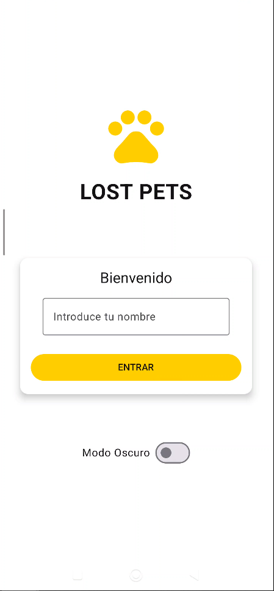
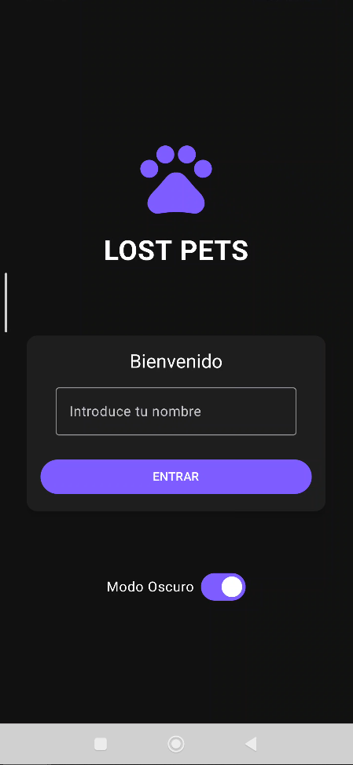
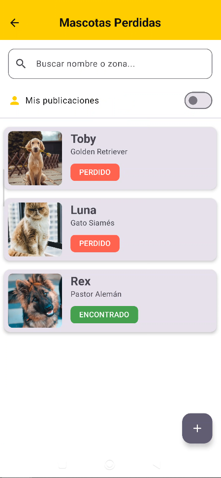
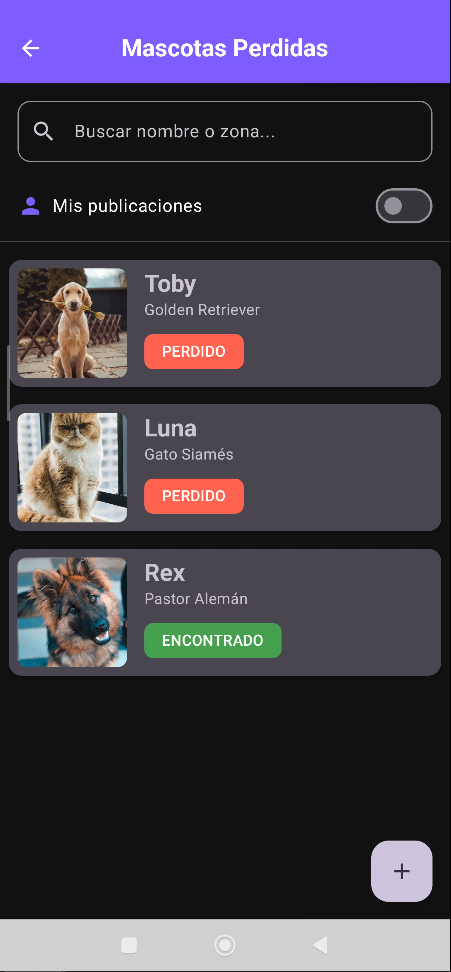
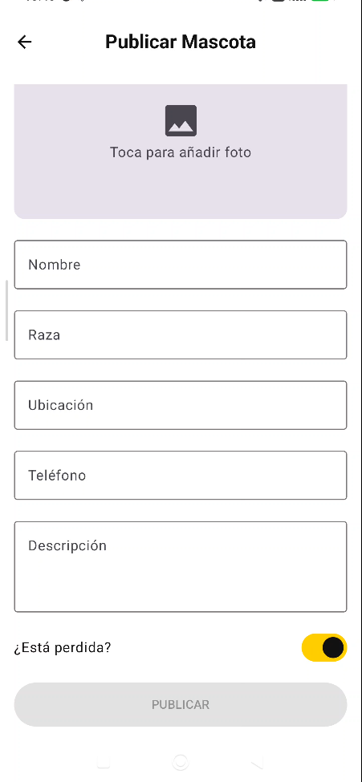
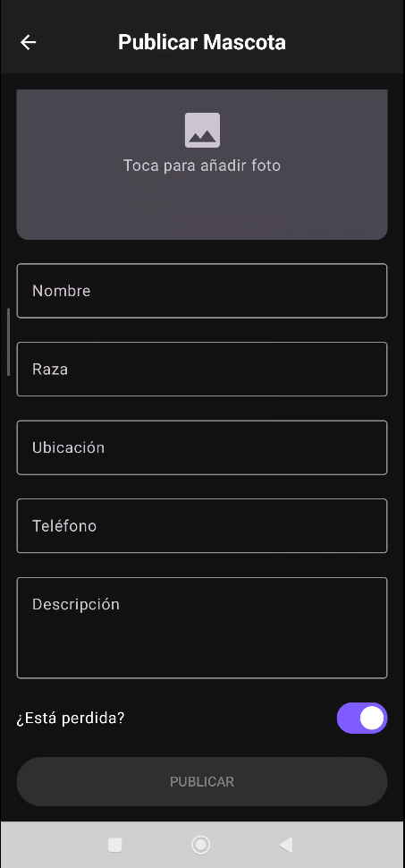

# 🐾 Lost Pets - Aplicación de Ayuda Animal

> **Proyecto Final - Desarrollo de Interfaces** > Una solución digital para la organización comunitaria y el bienestar animal.

## 📄 Descripción del Proyecto
**Lost Pets** es una aplicación móvil nativa para Android desarrollada íntegramente con **Kotlin** y **Jetpack Compose**. 

El objetivo principal es ofrecer una herramienta centralizada y accesible para que los vecinos de una comunidad puedan reportar mascotas perdidas o encontradas, facilitando el reencuentro con sus dueños mediante un diseño intuitivo y funcionalidades de contacto directo.

---

## 🚀 Características Principales

* **Gestión de Usuarios:** Sistema de Login simulado que permite identificar al autor de cada publicación.
* **Interfaz Adaptable (Theming):** Diseño visual coherente con soporte completo para **Modo Claro (Amarillo)** y **Modo Oscuro (Morado)**.
* **Búsqueda y Filtros:** Buscador integrado por nombre/zona y filtro rápido para ver solo "Mis Publicaciones".
* **Publicación de Anuncios:** Formulario completo con validación de datos, teclado numérico para teléfonos y selector de fotos desde la galería.
* **Detalle y Contacto:** Ficha completa de la mascota con botones de acción rápida (Llamar y Ver en Mapa).
* **Gestión (CRUD):** Los usuarios pueden crear anuncios y eliminar sus propias publicaciones.

---

## 📱 Galería de la Aplicación

A continuación se muestra el diseño de la interfaz (UI) y la experiencia de usuario (UX), destacando la adaptación a los temas claro y oscuro.

### 1. Pantalla de Bienvenida (Login)
*Diseño minimalista con personalización de tema desde el inicio.*

| Modo Claro | Modo Oscuro |
|:---:|:---:|
|  |  |

### 2. Listado Principal y Filtrado
*Visualización eficiente mediante `LazyColumn`. Incluye buscador y filtro de usuario.*

| Modo Claro | Modo Oscuro |
|:---:|:---:|
|  |  |

### 3. Formulario de Publicación
*Entrada de datos con validación y selección de imágenes.*

| Modo Claro | Modo Oscuro |
|:---:|:---:|
|  |  |

### 4. Detalle de Mascota
*Ficha informativa con acciones rápidas (Llamar) y distinción visual de estado.*

| Modo Claro | Modo Oscuro |
|:---:|:---:|
|  |  |

---

## 🛠️ Tecnologías Utilizadas

* **Lenguaje:** Kotlin
* **Framework UI:** Jetpack Compose (Material Design 3)
* **Navegación:** Jetpack Navigation Compose
* **Imágenes:** Coil (Carga asíncrona)
* **Integración:** Intents implícitos (Teléfono, Google Maps)

## 👤 Autor
Desarrollado por **[Tu Nombre]**.
